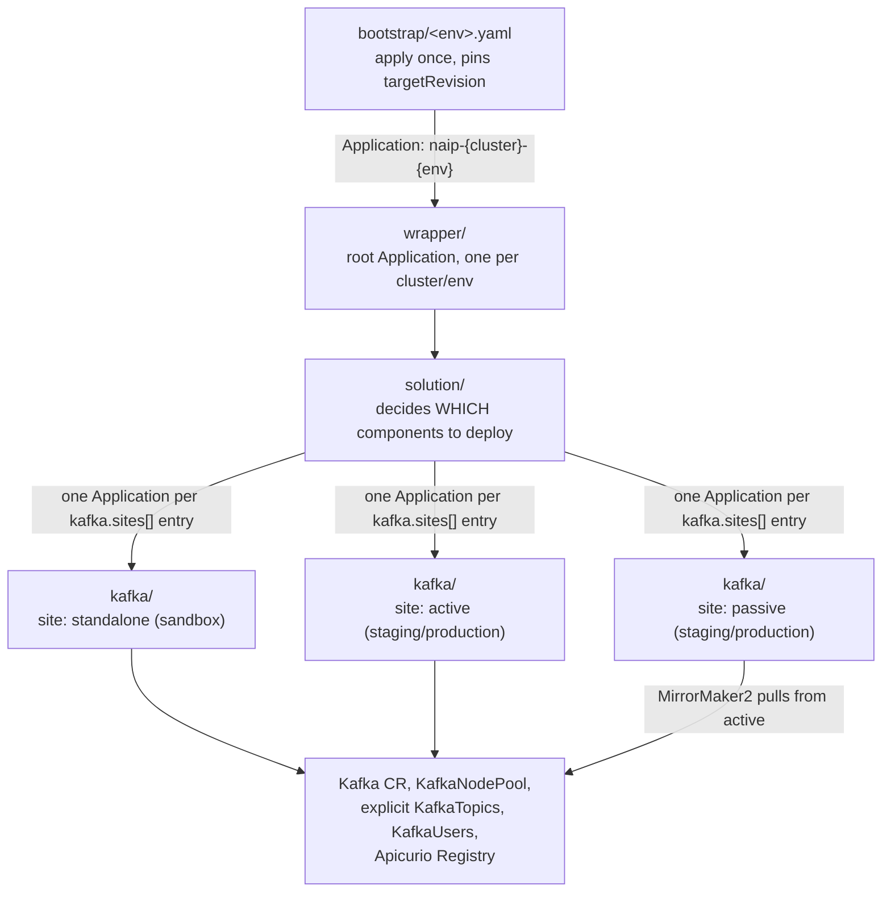
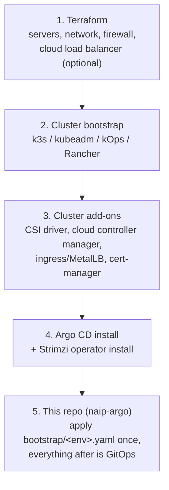

# naip-argo

A simplified, "lift-and-shift" version of the app-of-apps pattern used for Kafka
in the `solution-wrapper` / `solution-helm-chart` / `kafka-helm-chart` repos.

Three Helm charts, three Argo CD levels:



## Key simplifications vs. the original repos

| Original | This version |
|---|---|
| Topics auto-discovered by scanning every Spring Boot microservice's values | Topics are declared **explicitly** as a plain list in the `kafka` values block |
| Vault-backed secrets, dual/broker node-pool split, Cruise Control, rack awareness | Single `KafkaNodePool`, plain Kubernetes `Secret`s (swap for Vault/ESO later) |
| No cross-cluster replication | `KafkaMirrorMaker2` wired for an **active/passive** (DR) topology |
| No schema registry | **Apicurio Registry** deployment included |

## Layout

```
bootstrap/  - one plain Argo CD Application manifest per environment, applied once by hand/pipeline
wrapper/    - root Argo CD Application chart, one release per cluster/environment
solution/   - per-environment chart; renders the child "kafka" Argo CD Application(s)
kafka/      - leaf chart; renders Strimzi Kafka, topics, users, MM2, Apicurio
```

## Branching strategy: one branch, pin by tag

All environments live on a single trunk branch. Environment differences are
data (values files + `kafka.sites`), not code, so there is nothing to branch —
promoting a change means bumping a `targetRevision` (git tag/SHA), never
merging one environment's branch into another's:

- **sandbox** always tracks `main` (see [bootstrap/sandbox.yaml](bootstrap/sandbox.yaml)) — no promotion gate.
- **staging** and **production** each pin a release tag in their own
  `bootstrap/<env>.yaml` + `wrapper/values/<env>/values.yaml` +
  `solution/values/<env>/values.yaml`. Promotion = bump the tag in staging's
  files, verify, then bump the same tag in production's files.
- `solution/values/<env>/values.yaml`'s `kafkaChart.targetRevision` can pin
  the leaf `kafka` chart to a different ref than the rest of the tree, if you
  ever need to roll Kafka forward/back independently.

## Environments and Kafka topology

Three example environments live under `solution/values/<env>/values.yaml`:
sandbox, staging, production. Each environment's `kafka.sites` list controls
whether it gets one plain Kafka cluster or a full active/passive DR pair — the
`solution` chart renders **one child Argo CD Application per site**, so the
number of Kafka clusters an environment gets is purely a function of how many
entries are in `kafka.sites`:

| Environment | `kafka.sites` | Result |
|---|---|---|
| [sandbox](solution/values/sandbox/values.yaml) | one entry, `role: standalone` | a single Kafka cluster, no MirrorMaker2 |
| [staging](solution/values/staging/values.yaml) | two entries, `role: active` + `role: passive` | two Kafka clusters wired by MirrorMaker2 |
| [production](solution/values/production/values.yaml) | same shape as staging | same, but sized up and pointed at two distinct registered clusters (`destinationServer`) for real DR |

### Active/passive MirrorMaker2 model

- The **active** site is where applications produce/consume normally. It does
  **not** run MirrorMaker2 (no `mirrorMaker2` block).
- The **passive** (DR/secondary) site runs `MirrorMaker2` and continuously
  replicates topics *from* active *to* passive using
  `IdentityReplicationPolicy`, so topic names are **not** prefixed with the
  source cluster alias — this is what makes true active/passive failover
  possible (apps can point at either cluster using the same topic names).
- On failover you repoint applications at the passive cluster. To fail back,
  you flip the roles in values (remove `mirrorMaker2` from the new active,
  add it to the new passive pointing the other direction).
- Each site gets its own namespace (e.g. `staging-active`/`staging-passive`),
  created automatically via `CreateNamespace=true` on its Application.

## Apicurio Registry

Deployed per-cluster, backed by in-memory storage by default
(`apicurio/templates/apicurio-registry.yaml` in the `kafka` chart). This is
intentionally the simplest possible storage backend so the example always
works out of the box — swap `apicurio.storage` for a real backend (PostgreSQL
or Kafka-based `kafkasql`) before using this in production, and double check
the exact env var names against the Apicurio version you deploy (they changed
between the 2.x and 3.x major releases).

## Prerequisites: what this repo assumes already exists

This repo only contains Argo CD Application/Helm manifests — it does not
provision a cluster, install Argo CD, or install the Strimzi Kafka operator.
For a from-scratch environment (e.g. a Hetzner Cloud cluster with one master
and 2-3 workers), build that out as a separate, layered IaC stack that feeds
into this repo as its last step:



1. **Terraform** — provisions the servers, private network, firewall rules,
   SSH keys, and optionally a cloud load balancer resource.
2. **Cluster bootstrap** — turns the bare servers into a working Kubernetes
   cluster (e.g. k3s via a script/Ansible/`k3sup`, or kubeadm). Terraform
   doesn't do this natively; it's typically wired in via provisioners or a
   separate step. Community modules like `kube-hetzner` combine steps 1-3.
3. **Cluster add-ons** — the CSI driver (needed for Strimzi's PVCs) and cloud
   controller manager (needed for `Service type: LoadBalancer`), plus an
   ingress controller/MetalLB and cert-manager if required. Usually applied
   via Terraform's `helm`/`kubectl` providers or a plain script.
4. **Argo CD + the Strimzi Kafka operator** — installed via Helm chart or raw
   manifests. This is the boundary where generic infra IaC hands off to
   GitOps: once Argo CD is running, avoid also managing the same resources
   via Terraform.
5. **This repo** — apply the relevant `bootstrap/<env>.yaml` once (see below);
   from then on Argo CD self-manages `wrapper/` → `solution/` → `kafka/`.

## Bootstrapping: the one manual step

Once Argo CD and the Strimzi operator are installed (step 4 above), the
entire `naip-argo` tree for an environment is bootstrapped with a single
`kubectl apply`/`argocd app create` — everything after that is automated
(`syncPolicy.automated` with `selfHeal: true` at every level):

```
kubectl apply -f bootstrap/sandbox.yaml
```

That file creates one root Argo CD `Application` (e.g. `naip-sandbox-root`)
pointing at the `wrapper` chart. From there Argo CD cascades on its own:
`wrapper` creates the environment `Namespace` + shared `naip` `AppProject`
and a second-level Application pointing at `solution`, which in turn creates
one third-level Application per `kafka.sites[]` entry pointing at `kafka`,
which finally applies the Strimzi `Kafka`/`KafkaNodePool`/`KafkaTopic`/
`KafkaUser`/Apicurio custom resources. No further manual steps are needed —
repeat the same `kubectl apply` with `bootstrap/staging.yaml` /
`bootstrap/production.yaml` for the other environments.

## How to adapt this for a new project

1. Rename `naip-argo-*` in the three `Chart.yaml` files and update the
   `repoURL` values in [wrapper/values.yaml](wrapper/values.yaml),
   [solution/values.yaml](solution/values.yaml), every file under
   [wrapper/values/](wrapper/values), and every file under [bootstrap/](bootstrap)
   to point at your fork/copy of this repo.
2. Add one `wrapper/values/<env>/values.yaml` and one `solution/values/<env>/values.yaml`
   per environment, plus a matching `bootstrap/<env>.yaml`.
3. List your real topics under `kafka.topics` in each env's solution values file.
4. Decide the topology per environment: one `kafka.sites` entry
   (`role: standalone`) for a simple environment, or two entries
   (`role: active` / `role: passive`) for full DR — the passive entry's
   `mirrorMaker2.source.bootstrapServers` must point at the active entry's
   Kafka bootstrap address.
5. Pin each non-sandbox environment's `targetRevision` (in its `bootstrap/`,
   `wrapper/values/`, and `solution/values/` files) to a release tag instead
   of `main`, and promote by bumping that tag.
